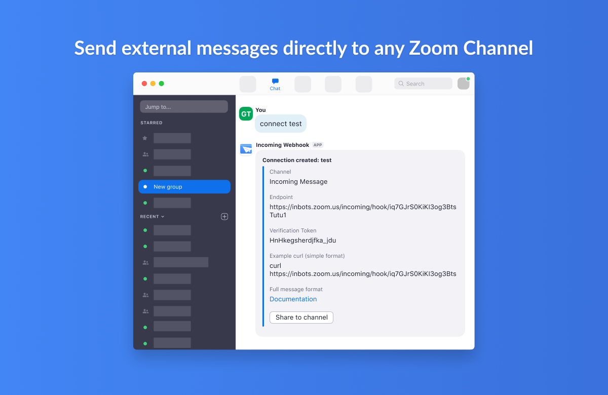
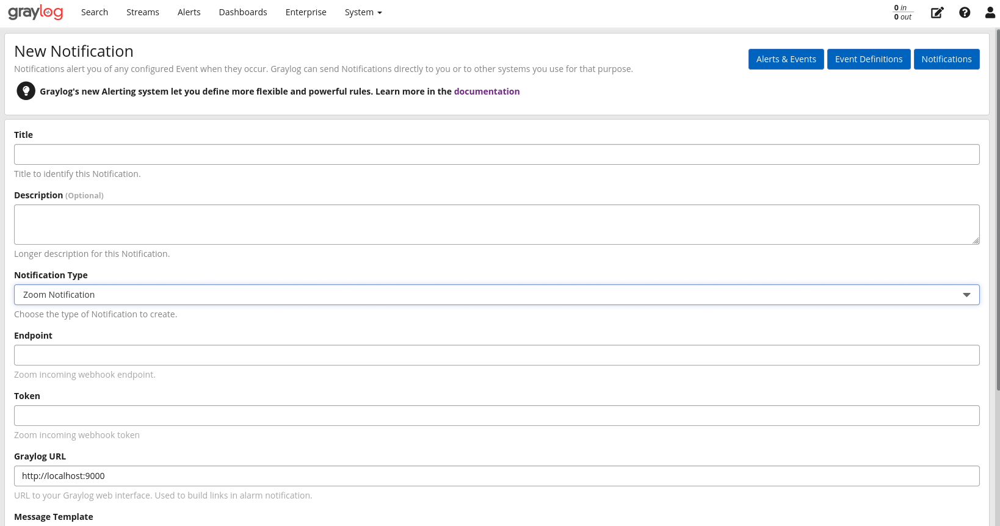

# ZoomNotificationPlugin Plugin for Graylog

This plugin has been developed and tested on graylog version 4.2.7. It may works on older versions of graylog but please test it before using it.

Installation
------------

[Download the plugin](https://github.com/tao-lian/graylog-plugin-zoom/releases)
and place the `.jar` file in your Graylog plugin directory. The plugin directory
is the `plugins/` folder relative from your `graylog-server` directory by default
and can be configured in your `graylog.conf` file.

Restart `graylog-server` and you are done.

Development
-----------

You can improve your development experience for the web interface part of your plugin
dramatically by making use of hot reloading. To do this, do the following:

* `git clone https://github.com/Graylog2/graylog2-server.git`
* `cd graylog2-server/graylog2-web-interface`
* `ln -s $YOURPLUGIN plugin/`
* `npm install && npm start`

Usage
-----

__Step 1: Install Zoom Incoming Webhook__

Install Incoming webhook plugin from Zoom marketplace:

[App Marketplace: Incoming Webhook](https://marketplace.zoom.us/apps/eH_dLuquRd-VYcOsNGy-hQ)

Note: make sure you have correct permission to approve the app installation, for more details: [Managing the Zoom App Marketplace](https://support.zoom.us/hc/en-us/articles/360032447812-Managing-the-Zoom-App-Marketplace)

__Step 2: Create a incoming webhook__

Using __/inc connect NAME__ in a channel to create a webhook. You will receive endpoint and verification token after incoming webhook successfully created.

__Step 3: Create a Zoom notification 

* Go to Graylog -> Alerts -> Notifications -> New Notifications and select "Zoom Notification" as notification type. 
* Using the endpoint URL and token generated in Step 2
* Graylog URL will be pre-populated with your current domain name. 
* Customise the message template

